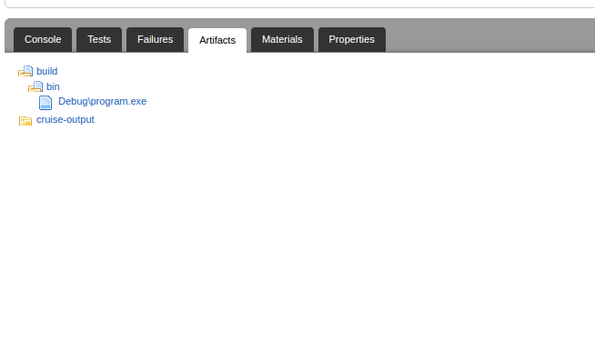

## Pipeline config

```xml
<pipeline name="golang-sample-31">
  <materials>
    <git url="https://github.com/tomzo/golang-artifacts-bug31.git" />
  </materials>
  <stage name="defaultStage">
    <jobs>
      <job name="defaultJob">
        <tasks>
          <exec command="ls">
            <arg>-la</arg>
            <runif status="passed" />
          </exec>
        </tasks>
        <resources>
          <resource>stcdev</resource>
          <resource>vs2015</resource>
        </resources>
        <artifacts>
          <artifact src="build/bin" dest="build" />
        </artifacts>
      </job>
    </jobs>
  </stage>
</pipeline>
```

## Error

<div>
  
</div>
